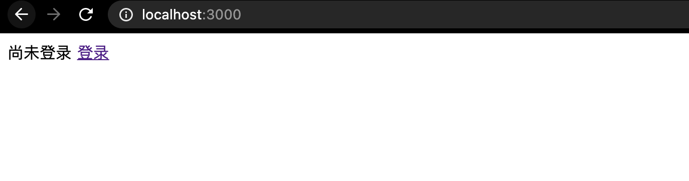
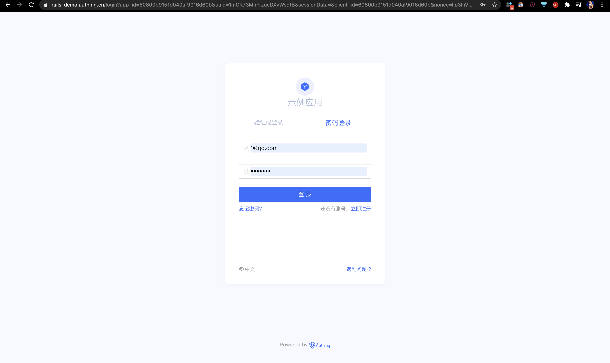
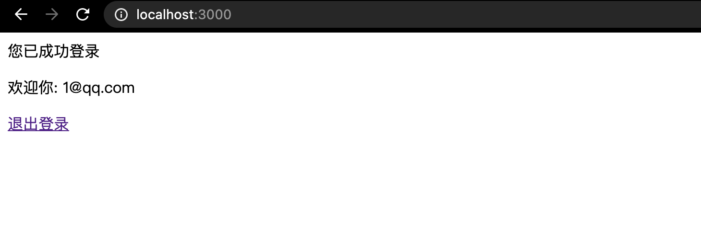

# Ruby on Rails + Authing 例子

## 介绍
本项目演示在 Ruby on Rails 中如何使用 Authing 实现用户身份管理（使用 [`authing_ruby`](https://rubygems.org/gems/authing_ruby) gem）   
也就是无需自己写注册登录（比如用 `devise` gem）

## 适合人群
想使用 Authing 的 Rails 开发者。  

## 演示什么？
演示两种登录方式：  
1. 传统方式：cookie session 管理登录态
2. JWT 方式：适合做 API 后端

## 运行前准备
1. 登录 [Authing](https://console.authing.cn/console/userpool) 后新建一个"用户池"，名字比如"测试用户池"(或其他任意名字)
2. 运行 `cp .env.example .env`，目的是复制一下文件，复制 `.env.example` 文件为 `.env`
3. 根据 `.env` 文件里的提示，填写用户池的各项信息，比如 `app id`, `userpool id`, `app host`，需要这些信息才能跑起来。
4. 设置回调地址，方法是 登录 Authing -> 选择某个用户池 -> 应用 -> URL设置 -> `登录回调 URL`, 写上 `http://localhost:3000/authing/callback` 因为这个 Rails 应用默认跑在 `3000` 端口，而 `authing/callback` 是对应 `routes.rb` 里的设置

## 如何运行
### 安装依赖
```
bundle install
```

### 运行
```
rails s
```
访问 http://localhost:3000


## 如何体验整个登录流程

### 传统方式 (使用 session)
1. 访问 [http://localhost:3000](http://localhost:3000)，此时页面上会显示"尚未登录"
  

2. 点击右侧的"登录"按钮，会跳转到 Authing 的托管登录页。
  


2. 注册：使用 `邮箱+密码` 或 `手机号+密码+验证码`，比如邮箱 `100@qq.com`, 密码 `123456789`
3. 注册完成后，进行登录
4. 此时会回到 `http://localhost:3000/` 看到登录成功的消息。并且显示邮箱 或 手机号（取决于你的注册方式）
  

### 传统方式是怎么实现的？
1. 用户登录态是用 session 实现，session 数据在 Rails 里默认是全部存到 Cookie 里，叫 `CookieStore`, 你也可以换成 Redis 来存， 具体细节可以看 [Securing Rails Applications](https://guides.rubyonrails.org/security.html#session-storage), 以及 [Action Controller Overview#Session](https://guides.rubyonrails.org/action_controller_overview.html#session) 这个是 Rails 的东西，和  Authing 毫无关系
2. 当用户访问 `http://localhost:3000/` 时，我们判断 `session[:user_id]` 是否存在，如果有就当做已登录，没有就是没登录
3. 点击"登录"按钮会跳转到 Authing 的认证地址，这个地址来自于: `某用户池`->`某应用`->`基础设置`->`认证地址`
4. 登录成功后，页面会跳转到回调地址，这个回调地址来自于: `某用户池`->`某应用`->`URL设置`->`登录回调地址`，我这里设置的是 `http://localhost:3000/authing/callback` 跳转到这个地址时会带上参数,完整 URL 例子：`http://localhost:3000/authing/callback?code=ZndQ4xxhds3kNHlaXYgOSKhBVEhEHLmN1HOX3O8IZf9&state=tL5NYtMet` 这个 `code` 参数是核心
5. 我们拿到 code 参数后，去换取 AccessToken (`getAccessTokenByCode(code)`)
6. 这个 Token 可以再用来换取用户信息 (`getUserInfoByAccessToken(access_token)`)
7. 用户信息里有一个 `sub` 是用户独一无二的 ID
8. 我们用这个 id 来新建 User 纪录即可，比如 `user = User.find_or_create_by(authing_user_id: sub)`
9. 最后我们设置一下 session: `session[:user_id] = user.id ` 就结束了。


### JWT 方式
（还在写）

## 常见问题
1. 对于一个前后端分离的项目，比如 React+Rails 或 Vue+Rails，加入 Authing 后有何不同？
	* 没有什么不同，同样用 JWT 做身份认证。

2. 对于一个传统的 Rails 项目（用 `app/views/` 而不是前后端分离，用 API  沟通）又怎么用 Authing？
	* 自己通过 cookie+session 实现登录态

3. 忘记密码怎么做？
	* 先登出，然后在 Authing 的托管登录页面做
	* 如果不用 Authing 提供的托管页面做，希望用自定义的界面
	* [通过短信验证码重置密码](https://docs.authing.cn/v2/reference/sdk-for-node/authentication/AuthenticationClient.html#%E9%80%9A%E8%BF%87%E7%9F%AD%E4%BF%A1%E9%AA%8C%E8%AF%81%E7%A0%81%E9%87%8D%E7%BD%AE%E5%AF%86%E7%A0%81)
	* [通过邮件验证码重置密码](https://docs.authing.cn/v2/reference/sdk-for-node/authentication/AuthenticationClient.html#%E9%80%9A%E8%BF%87%E9%82%AE%E4%BB%B6%E9%AA%8C%E8%AF%81%E7%A0%81%E9%87%8D%E7%BD%AE%E5%AF%86%E7%A0%81)

4. 更新密码怎么做？
	* [更新密码](https://docs.authing.cn/v2/reference/sdk-for-node/authentication/AuthenticationClient.html#%E6%9B%B4%E6%96%B0%E7%94%A8%E6%88%B7%E5%AF%86%E7%A0%81)

<!--
4. 注册/登录页面怎么做？

5. 手机号+验证码登录怎么做？

6. 邮箱+验证码怎么做？

7. 用户资料怎么处理？就是头像，昵称，性别，出生日期
-->
